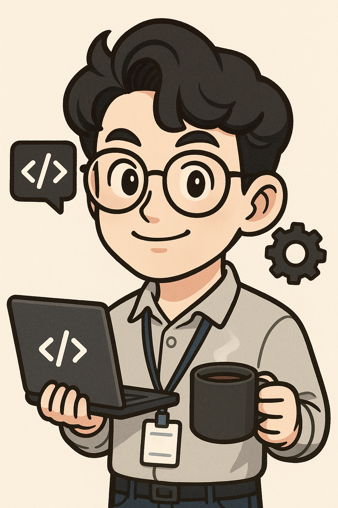

# 👋 안녕하세요, 웹 개발자입니다

  
  
  ### 🚀 웹/백엔드 개발자
  
  **15년 7개월의 풍부한 개발 경험**을 바탕으로 안정적이고 확장 가능한 웹 서비스를 개발합니다.
  
  
  

---

## 📋 About Me

> **"신뢰는 성실함에서 비롯된다"**

지난 15년 6개월간 다양한 산업군에서 웹 및 백엔드 개발자로 근무하며, 결제 시스템, 교육 플랫폼, 투자 콘텐츠 서비스 등 여러 형태의 웹 서비스를 개발하고 운영해왔습니다.

### 🎯 핵심 가치
- **안정성**: 서비스의 안정성과 유지보수성을 최우선으로 고려
- **성능**: DB 최적화 및 시스템 성능 향상에 대한 깊은 이해
- **책임감**: 맡은 일은 끝까지 책임지고 완수하는 신뢰할 수 있는 개발자
- **성장**: 레거시 시스템에서 최신 기술로의 성공적인 마이그레이션 경험

---

## 🛠️ 기술 스택

### 🔧 Backend

### 🗄️ Database

### 💻 Frontend

### 🔌 API & Tools

---

## 💼 경력 사항

### 🏢 페이레터 (2022.08 ~ 2025.04)
**페이먼츠플랫폼팀 팀원** | *2년 9개월*

#### 🎯 주요 성과
- **.NET Core 마이그레이션**: 기존 Classic ASP 시스템을 .NET Core 기반으로 성공적으로 리팩토링
- **다양한 결제 서비스 개발**: 아프리카TV 전용 헥토펌뱅, URL 결제, 애플페이 등 신규 결제 방식 구현
- **AML 시스템 구축**: 자금세탁방지를 위한 가맹점 정보 갱신 자동화 및 위험군 식별 로직 구현
- **DB 최적화**: 정산 및 통계 DB 분리 설계 및 성능 최적화

#### 🛠️ 기술 스택
`.NET Core(MVC)` `Classic ASP` `ASP.NET` `C/C++` `MS-SQL` `JQuery` `API` `데몬 서비스`

---

### 🏢 핀업 (2017.06 ~ 2022.07)
**개발본부 차장 팀원** | *5년 2개월*

#### 🎯 주요 성과
- **통합 플랫폼 개발**: 투자 콘텐츠 및 교육 플랫폼 웹 서비스 개발
- **다양한 서비스 구현**: 슈퍼스탁, 슬기로운 투자생활, 핀업 챌린지 등 통합 개발
- **OAuth2 인증**: Apple SNS 회원가입 연동 기능 구현
- **서비스 통합**: PC, 모바일, API 구조 일원화를 통한 서비스 리뉴얼

#### 🛠️ 기술 스택
`ASP.NET` `MS-SQL` `JQuery(JavaScript)` `API`

---

### 🏢 스트롱홀드 (2014.12 ~ 2015.10)
**개발팀 과장 팀장** | *11개월*

#### 🎯 주요 성과
- **글로벌 사이트 관리**: 폴스타 글로벌 사이트 유지보수 및 기능 개선
- **사이트 재개발**: AQK 사이트 재개발 (DB 구조 개선, UI 개편)
- **콘텐츠 관리**: 자사 홈페이지 콘텐츠 관리 기능 개선

#### 🛠️ 기술 스택
`ASP.NET` `MS-SQL` `JQuery(JavaScript)`

---

### 🏢 페이레터 (2011.07 ~ 2014.09)
**운영팀 대리(주임연구원) 팀원** | *3년 3개월*

#### 🎯 주요 성과
- **빌링 시스템 운영**: AfreecaTV, Qeon, 한경TV 등 파트너사별 빌링 시스템 운영
- **API 운영**: 클래식 ASP + MS-SQL 기반 결제 API 운영 및 유지보수
- **유연한 로직**: 파트너별 운영 정책에 따른 유연한 로직 적용 및 서비스 유지

#### 🛠️ 기술 스택
`Classic ASP` `ASP.NET` `MS-SQL` `JQuery(JavaScript)`

---

### 🏢 제이앤씨(J&C) (2008.01 ~ 2011.06)
**웹개발 사원(연구원)** | *3년 6개월*

#### 🎯 주요 성과
- **게임 포털 개발**: 자사 게임 홈페이지 개발 및 유지보수
- **백오피스 설계**: Classic ASP 기반 게임 웹 콘텐츠 백오피스 설계 및 배포
- **UI/UX 개발**: JQuery 기반 사용자 인터페이스 개발 및 비동기 처리

#### 🛠️ 기술 스택
`Classic ASP` `MS-SQL` `JQuery(JavaScript)`

---

## 📊 경력 통계

| 항목 | 수치 |
|:---:|:---:|
| **총 경력** | 15년 7개월 |
| **회사 경험** | 5개 회사 |
| **주요 기술** | 10+ 기술 스택 |
| **도메인 경험** | 결제, 교육, 투자, 게임 |

---

## 🎓 학력 & 자격증

### 📚 학력
- **한국방송통신대학교 서울지역대학** (2012.03 ~ 2016.02)
  - 컴퓨터과학과 (편입) 졸업
  - 학점: 73/100
- **경남도립남해대학** (2003.02 ~ 2008.02)
  - 컴퓨터정보과 졸업
  - 학점: 3.92/4.5

### 🏆 자격증
- 전산실기교사자격증 (2008.02)
- 정보처리산업기사 (2007.12)
- 워드프로세서 2급 (2007.07)
- 컴퓨터활용능력 3급 (2001.12)

---

## 🚀 핵심 강점

### 💡 기술적 역량
- **레거시 시스템 마이그레이션**: Classic ASP → .NET Core 성공적 전환
- **결제 시스템 전문성**: 다양한 결제 방식 및 보안 시스템 구현
- **DB 설계 및 최적화**: 대용량 데이터 처리 및 성능 튜닝
- **풀스택 개발**: 프론트엔드부터 백엔드까지 통합 개발

### 🎯 비즈니스 이해도
- **다양한 도메인 경험**: 결제, 교육, 투자, 게임 등 다양한 산업군
- **안정성 중심 개발**: 장기간 서비스 운영을 통한 안정성 확보
- **사용자 중심 사고**: 실제 사용자 피드백을 반영한 서비스 개선

---

## 📞 연락처

### 💬 함께 일하고 싶습니다!

안정적이고 확장 가능한 웹 서비스 개발에 관심이 있으시다면 언제든 연락주세요.

**📍 위치**: 대한민국

---

  
  
  **⭐ 이 프로필이 도움이 되었다면 스타를 눌러주세요!**

